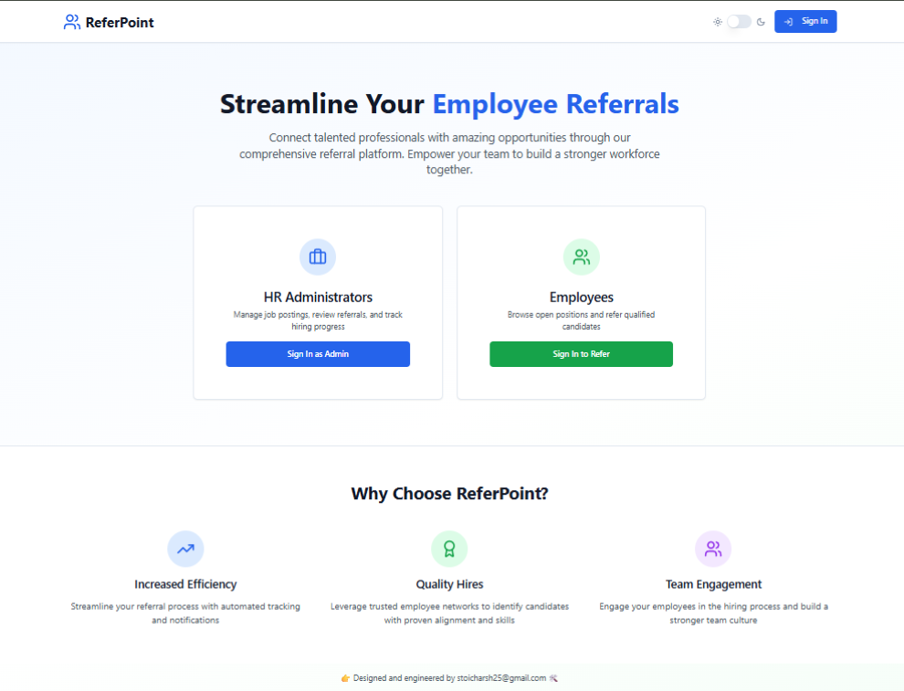
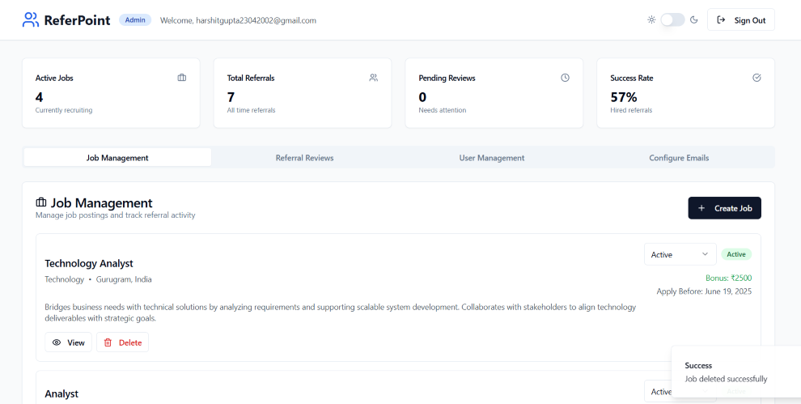
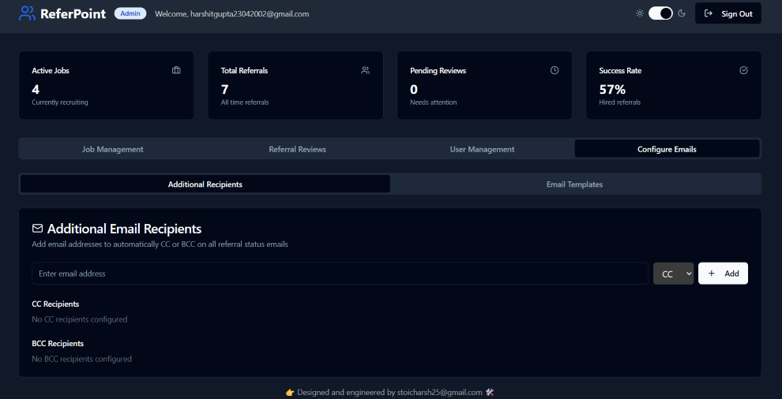
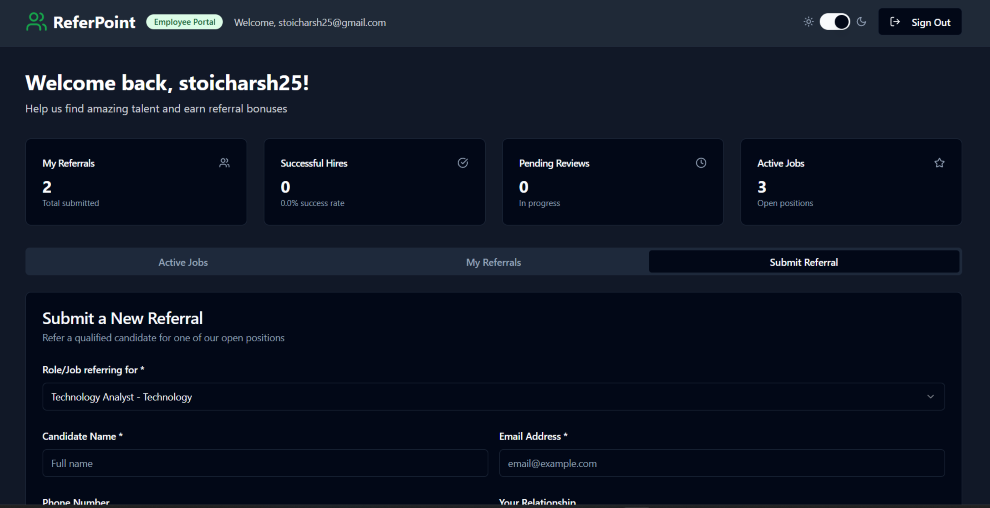

# Refer Point - Empowering employees to refer, enabling HR to hire—faster 💼✨

Referly is a versatile **Employee Referral Management Platform** designed to streamline the internal hiring process. It can be seamlessly integrated into your existing company portal - without spending a dime on backend tools or services.
  

## 🌐Live Demo

https://refer-point.vercel.app/
  

## 💡Use Cases

1. **Simplified Process & Automated Follow-ups:** Minimize HR effort & Maximize referral engagement.
2. **Ideal for Startups and Bootstrapped Teams:** Simplifies internal referrals for small teams that don’t want to invest in large-scale ATS tools.
3. **Internal Referral Drives:** Host periodic referral campaigns and keep everything managed in one place.
4. **Communication Looping:** Keep employees in the loop with auto-generated email templates for key hiring steps.
5. **Plug-and-Play for Companies:** Add this to your existing HR portal with minimal configuration effort.
  

## How It Works?

1. **Sign-Up & Verification:**
   - Users sign up on the platform. Admins (typically hiring leads) verify these profiles before login access is granted, ensuring control and security.

3. **Admin Dashboard:**  
   - Post and manage job descriptions.
   - View and update referrals status: **Scheduled**, **Hired**, or **Rejected**.
   - Each action triggers a pre-written email draft using the default mail client to keep everyone informed.

4. **User Dashboard:**  
   - Employees can view active job openings.
   - Submit referrals with ease.
   - Track previously submitted referrals and their current status.

5. **User Experience Add-on:**  
   - Built-in **Light/Dark mode** toggle for better accessibility and visual comfort.  
  

## 🔐Demo Credentials

- **Admin Dashboard**  
  Username: `admin@admin.com`  
  Password: `password123`  

- **User Dashboard**  
  Username: `user@user.com`  
  Password: `password123`  
  

## Video Demo
https://github.com/user-attachments/assets/2fa61541-a069-49ff-9121-c476df684a52

  

## 🛠️Tech Stack and Tools
- **Cursor Ai**
- **Lovable.dev**
- **Supabase for Storage, Auth**
  

## 📸Screenshots

  

  

## License
This project is licensed under the **GNU General Public License v3 (GPL-3.0)**.
Read the license carefully.
  

## 📬Want to See the Source Code?

For security and IP protection reasons, the full source code is in a private repository.  
**The full source code is available upon request for review purposes.**  
Please contact me via [Email](mailto:stoicharsh25@gmail.com) or [LinkedIn](https://www.linkedin.com/in/stoic-harsh) if you'd like access or a technical walk-through.
